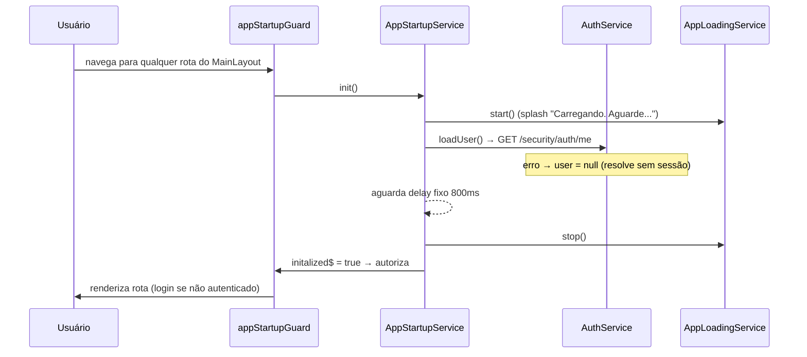
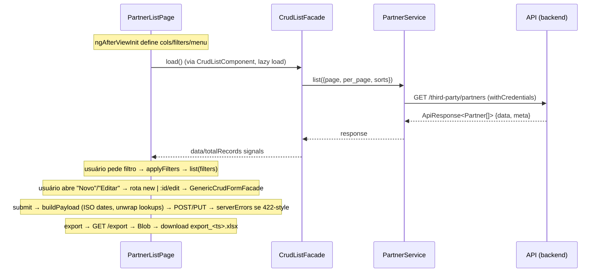

# SPEC — Simplify ERP (painel web)

> Especificação técnica (estrutura interna). A visão de produto/negócio está em [`prd.md`](prd.md). Este documento descreve **como o sistema está estruturado e como as partes trabalham juntas**.

O código-fonte é a fonte da verdade deste documento. Itens marcados como *(inferência)* são conclusões razoáveis a partir do código; não há backend nem histórico além do git para confirmá-los.

## 1. Stack e versões

| Item | Versão | Onde consta |
|---|---|---|
| Angular | `^21.1.2` | `package.json` |
| TypeScript | `~5.9.2` | `package.json` |
| PrimeNG | `^21.1.1` | `package.json` |
| PrimeFlex / PrimeIcons / Primeuix themes | `^4.0.0` / `^7.0.0` / `^2.0.3` | `package.json` |
| ngx-mask | `^22.1.0` | `package.json` |
| RxJS | `~7.8.0` | `package.json` |
| Vitest | `^4.0.8` (+ `@vitest/coverage-v8`) | `package.json` |
| ESLint | `^10.9.1` + angular-eslint `^22.2.0` | `package.json` |
| Gerenciador de pacotes | npm `11.8.0` | `package.json` (`packageManager`) |

## 2. Visão geral da arquitetura

Aplicação **Angular SPA (standalone)**, monolito único, com componentes standalone, *signals*, *control flow* moderno (`@if/@for`) e rotas com lazy loading. Separação em quatro camadas:

- **`core/`** — camada transversal: autenticação, guardas, interceptadores, contratos, modelos, enums, configurações (tema/menu/traduções) e serviços utilitários. Não conhece features.
- **`features/`** — módulos de negócio `security`, `third-party`, `configuration` e `error`. Cada feature é um conjunto de rotas lazy com páginas (`*.page`), diálogos (`*.dialog`), drawers, facades, serviços, modelos e enums.
- **`shared/`** — componentes encontrados com controle de valor (`lookup`, `crud-list`, `form-control-errors`, etc.), **facades** reutilizáveis de listagem/formulário (`crud-list.facade`, `crud-form.facade`), *ui wrappers* (`list-page.ui`, `form-page.ui`, `form-dialog.ui`), pipes, validators e diretivas.
- **`layouts/`** — shell: `MainLayout` (navbar + sidebar + rota) e `ErrorLayout`.

```
src/app/
├── core/                 # transversal
├── features/
│   ├── security/         # auth (login), users, roles
│   ├── third-party/      # partners, partner-types
│   ├── configuration/    # module-service (permissões)
│   └── error/            # páginas 403/404/500/502/503
├── layouts/              # main layout + error layout
└── shared/               # componentes/facades/ui compartilhados
```

### 2.1 Bootstrap

`src/main.ts` chama `bootstrapApplication(App, appConfig)`.

- `App` (`app.ts`) renderiza `p-toast`, `p-confirmdialog`, `app-drawer-host` e o roteador; enquanto `AppLoadingService.isLoading()` mostra um splash screen.
- `app.config.ts` registra: `MessageService`, `ConfirmationService`, `DialogService`, `errorResponseInterceptor` (HTTP), PrimeNG (`ripple`, tema, traduções pt-BR) e ngx-mask (aliases).
- `app.routes.ts`: `/security/auth` (login, fora do layout), rota raiz `MainLayout` protegida por `appStartupGuard` contendo `security` e `third-party`, `/error/:code`, wildcard `**` → `/error/404`.

### 2.2 Fluxo de inicialização



Sem cookie válido, `loadUser` resolve com `user = null`; as rotas guardadas por `permissionGuard` avaliam permissões (`PermissionService.has`) e, sem permissão, redirecionam para `/error/403`. O `appStartupGuard` roda uma única vez por ambiente (`ReplaySubject`).

## 3. Autenticação e autorização

### 3.1 AuthService (`core/auth/services/auth-service.ts`)

- `login(LoginRequest)` → `POST {base}/security/auth/login` — retorna `TokenDetails` (`access_token`, `token_type`, `expires_in`), **mas o app não persiste token em nenhum lugar**: todas as chamadas são `withCredentials: true` (cookie). *(inferência: o backend usa cookie de sessão; o token retornado não é utilizado pelo front)*.
- `loadUser()` → `GET {base}/security/auth/me` — alimenta `user$` (`BehaviorSubject<User>`).
- `logout()` → `POST {base}/security/auth/logout` e navega para `/security/auth/login` via `finalize`.

### 3.2 PermissionService (`core/auth/services/permission-service.ts`)

- `has(permission)` → `true` se o usuário tem a permissão **ou** a permissão coringa `*`.
- `hasAny(permissions[])` → true se alguma casar.

### 3.3 Guardas

- `permissionGuard` (`core/guards/permission-guard.ts`): lê `route.data['permission']`; aguarda a inicialização da aplicação; sem permissão navega para `/error/403` (repassando `username` via `history.state`) e bloqueia.
- `pendingChangesGuard` (`core/guards/pending-changes-guard.ts`): `canDeactivate` — usa `component.facade.canDeactivate()`, que confirma saída se o formulário estiver com alterações não salvas (`confirm-dialog`).
- `appStartupGuard` já descrito em 2.2.

## 4. Contratos (core/contracts)

| Contrato | Assinatura | Implementações |
|---|---|---|
| `CrudService<T>` | `list(params?)`, `get(id)`, `edit(id)`, `create(payload)`, `update(id,payload)`, `delete(id)` | Role, User, Partner, PartnerType services |
| `LookupService` | `search(filter): ApiResponse<LookupItem[]>` | Role, Partner, PartnerType (`UserService.search` lança erro) |
| `LogableService` | `activityLogs(id, params?)` | Role, User, Partner |
| `ExportableService` | `export(params): Observable<Blob>` | Role, User, Partner |
| `FormPageFacade<T>` | signals `entity/meta/warnings/...` + `loadLogs()` | `CrudFormFacade` (ver 7.x) |

`HttpQueryBuilderService` (core/services): serializa `ListRequestParams` em `HttpParams`, aninhando objetos (`filters[x][eq]`) e arrays (`keys[]`).

## 5. Modelos centrais

- `ApiResponse<T>` (`core/models/api-response.ts`): envelope **obrigatório** de todas as respostas — `{ success, message, data, warnings?, links?, errors?, meta? }`.
- `ApiMetaType`: chaves definidas por `ApiMetaOption` — `editable`, `current_page`, `last_page`, `per_page`, `total`.
- `BaseEntity`: `{ id, created_at?, updated_at? }`.
- `LookupItem`: `{ key, label, sublabel?, meta? }`; `LookupResult` normaliza `meta` → `{ items, total, page, perPage }`.
- Modelos de domínio: `User` (com `permissions: string[]`, `roles: Role[]`, `is_admin`), `Role` (com `permissions: RolePermission[]`), `Module`/`ModuleResource`/`ModuleResourcePermission` (árvore de permissões), `Partner` (extenso, ver enums em `features/third-party/partners/enums`), `PartnerType`.

## 6. Integração com a API

- **Base URL**: `environment.baseUrlApi` (`http://localhost:8000/api`) — `src/environments/`.
- **Autenticação**: cookie; todas as chamadas com `withCredentials: true`.
- **Convenções de endpoint por recurso** (base substituída por `roles`, `users`, `partners`, `partner-types`):

| Operação | Método / rota |
|---|---|
| Listar | `GET {base}` (query: `filters` aninhado, `page`, `per_page`, `sorts`) |
| Obter para visualização | `GET {base}/{id}` |
| Obter para edição | `GET {base}/{id}/edit` |
| Criar | `POST {base}` |
| Atualizar | `PUT {base}/{id}` |
| Excluir | `DELETE {base}/{id}` |
| Lookup | `GET {base}/lookup` (params `q`, `keys`, `page`, `pageSize`) |
| Histórico | `GET {base}/{id}/activity-logs` |
| Exportação | `GET {base}/export` → `Blob` |
| Definir permissões | `PATCH {base}/{id}/permissions` com `{ ids: number[] }` (roles/partners) |

- **Auth**: `POST /security/auth/login`, `GET /security/auth/me`, `POST /security/auth/logout`.
- **Módulos**: `GET /core/modules` e `GET /core/modules/{id}` (`ModuleService`, usado na tela de permissões).

> **Formato de filtros**: `RequestFiltersType = Record<field, Partial<Record<FilterOperator,'eq'|'ne'|'gt'|'gte'|'lt'|'lte'|'like', any>>>`. Ex.: `filters[name][like]=jo%C3%A3o`. Ordenação: `sorts` prefixado com `-` para descendente (`-id`).
> **Datas**: enviadas como `YYYY-MM-DD` (`DateUtilsService.formatIsoDate`); na carga, `parseIsoDates` converte strings nesse formato para `Date`.
> **Lookup**: valores de formulário ficam como `LookupItem`; ao submeter, `unwrapLookups` converte campo único para `key` e arrays para o `meta` de cada item.

## 7. Camadas de listagem e formulário (shared)

### 7.1 Listagem — `CrudListFacade<T>` + `CrudListComponent`

`CrudListFacade` (shared/facades/crud-list.facade.ts) concentra o estado da listagem em signals (`data`, `loading`, `error`, `totalRecords`, `requestParams`, `exportMenu`):

- `load()` → `service.list(requestParams)`.
- `applyLazyLoad(page, per_page, sorts)` → atualiza params e recarrega (tabela `p-table` com lazy loading).
- `applyFilters(filters)` → grava filtros, volta à página 1, recarrega.
- `delete(entity)` → confirma via `ConfirmDialogService` e chama `service.delete`; remove do array local.
- `can/canCreate/canUpdate/canDelete/canView` → checagens de permissão.
- `export(format, extension)` → `service.export` ou `exportCustom`; `downloadBlob` dispara download `export_<timestamp>.<ext>`.

`CrudListComponent` (shared/components/crud-list) renderiza a tabela: colunas tipadas (`TableColumn<T>` com `ColumnType`, pipe customizado, `enumOptionLabels`, template), menu de ações/contexto (mobile), seleção, paginação, modo mobile (cards) via media query (`max-width: 768px`) e o `FilterDefinerComponent`.

`FilterDefinerComponent` (drawer) monta filtros campo a campo (operadores pt-BR), com máscara e formato por `ColumnType`; emite `apply(filters)`.

### 7.2 Formulário — `CrudFormFacade<T, TState, TPayload>` + `GenericCrudFormFacade<T>`

`CrudFormFacade` (shared/facades/crud-form.facade.ts) é a base abstrata. Estados via signals: `mode`, `entity`, `state`, `meta`, `warnings`, `loading`, `saving`, `serverErrors`; computados `isCreate/isEdit/isView/hasServerErrors/hasActivityLogsMethod`.

- `init(mode, form, id)`: checa permissão (`config.permission[create|update|view|action]`), desabilita o form em modo visualização (ou em edição quando `meta.editable === false`), e carrega dados quando aplicável.
- `submit(form, id)`: valida (marca touched), monta payload via `buildPayload`, chama `persist`, aplica `meta`/`warnings`, exibe toast de sucesso, navega de volta (ou callback `navigateAfterSave`) e, em erro, aplica `serverErrors` campo a campo.
- `applyServerErrors(response)`: associa `response.errors` aos controles (remove o erro automaticamente quando o usuário digita) e acumula os não-campo em `serverErrors`.
- `canDeactivate(form)`: alerta se houver mudanças não salvas.
- `loadLogs()`: delega ao `LogableService` do recurso.

`GenericCrudFormFacade<T>` implementa os hooks padrão: `fetchData` usa `edit(id)` no modo edição e `get(id)` no visualização; `applyLoadedData` faz `patchValue` com datas convertidas; `buildPayload` converte `Date`→ISO e desempacota lookups; `persist` chama `create`/`update`.

### 7.3 UI wrappers

- `list-page.ui`: página-padrão com título, breadcrumb e slots de template (`appTemplate`).
- `form-page.ui`: formulário em página, com botão de **Histórico de atividade** (abre drawer) quando o recurso é `LogableService`.
- `form-dialog.ui`: o mesmo para diálogos (slot `footer`).

### 7.4 Lookup

`LookupComponent` (shared/components/lookup) implementa `ControlValueAccessor`: autocomplete com debounce (300ms), paginação e hidratação por chaves (`keys`). `LookupFacade` normaliza `ApiResponse<LookupItem[]>` em `LookupResult`. Exemplos de uso real: `RoleLookupComponent` (perfis no usuário e filtro de usuários) e `PartnerTypeLookupComponent` (tipo de parceiro no formulário/filtro de parceiros).

## 8. Diálogos, drawers e navegação

### 8.1 Rotas-dialog (`DynamicDialogHostComponent`)

Diálogos modais são rotas filhas de uma listagem (roles e partner-types). O componente host (shared/components/dynamic-dialog-host):

1. Lê `route.data['dialog']` (`DialogRoute` = `{ component, config, backPath? }`).
2. Abre o dialog via `DynamicDialogService.open(component, config)` (título, tamanho `sm/md/lg` → 500/840/1020px, breakpoints para largura ≤ `width + 5vw`), mesclando `route.params` em `config.data`.
3. Ao fechar (X/Escape/fechou), navega de volta à rota pai (a listagem permanece montada atrás). Se a rota foi abandonada externamente, apenas fecha o dialog.

Após salvar, os diálogos disparam `DialogRefreshService.notifySaved()`, e a listagem inscrita em `saved$` recarrega (role-list e partner-type-list fazem isso).

### 8.2 Drawers (`DynamicDrawerService` + `DrawerOutletDirective`)

Sistema próprio de painéis laterais empilháveis (signal stack, z-index incremental). Componentes injetam `DRAWER_REF` (para fechar) e `DRAWER_CONFIG` (dados). Usado pelo **Histórico de atividade** e pela sidebar mobile. Animação de fechamento: 800ms antes de remover da pilha.

## 9. Histórico de atividade (activity logs)

Abre como drawer (`EntityActivityLogListDrawer`) a partir de `form-page.ui`/`form-dialog.ui`. Busca `service.activityLogs(id)`, agrupa por dia (Hoje/Ontem/`dd/mm/yyyy`), ordena desc, expande o grupo mais recente e exibe marcadores por ação (`ActivityLogAction`: CREATED/UPDATED/DELETED/APPROVED/AUTH). Recursos com `LogableService`: roles, users e partners.

## 10. Tratamento de erros

### 10.1 Interceptor HTTP (`error-response-interceptor.ts`)

`tap({ error })` trata o status:

| Status | Ação |
|---|---|
| 401 | Toast "Você precisa fazer login..." e navega para `/security/auth/login` (exceto se a URL já for o login). |
| 403 | Navega `/error/403` (com `username`). |
| 404 | Navega `/error/404`. |
| 500 | Navega `/error/500`. |
| 502 | Navega `/error/502`. |
| 503 | Navega `/error/503` (também para `statusText === 'Unknown Error'`, ex. backend fora do ar). |

Sempre para o `AppLoadingService`.

### 10.2 Página de erro

`features/error/pages/error` contém configurações de UI por código (403/404/500/502/503) com títulos, descrições e ações (voltar / ir para home / ir para login). `ErrorLayout` renderiza a barra de rodapé com usuário autenticado (do `history.state.username`), data de acesso e IP.

### 10.3 Erros de formulário

`CrudFormFacade.applyServerErrors` vincula `response.errors` (chave = caminho do campo) aos controles; o `FormControlErrorsComponent` exibe mensagens padronizadas (required, minlength, maxlength, min, max, email, phone, pattern, cpf/cnpj, server). Erros de validação no cliente impedem `submit`.

## 11. Configuração, tema e tradução

- **Tema (`core/config/theme.ts`)**: preset Aura customizado; cor primária baseada em zinc; suporte a dark mode via seletor `.dark-mode`; prefixo `p`; ripple ativado.
- **Tradução (`core/config/translation.ts`)**: locale completo pt-BR para componentes PrimeNG (calendário, datatable, etc.).
- **Máscaras (`core/config/masks-aliases.ts`)**: `PHONE_BR` e `DOCUMENT` (CPF/CNPJ/genérico). Máscaras do tipo `A` aceitam alfanumérico. Usadas em inputs com `ngx-mask` e em listagens/filtros.
- **Menu (`core/config/menu.ts`)**: `MENU` com itens e permissões — Home (`/`), Terceiro (Parceiros `partners.viewAny`, Tipos de parceiro `partnerTypes.viewAny`), Catálogo (Produtos `products.viewAny`), Configurações (`core.configurations`) e Segurança (Usuários `users.viewAny`, Perfis `roles.viewAny`).
- **Layout**: navbar (avatar, usuário, menu perfil/logout), sidebar com logo (`LogoType.Mini`/`Extended`), expandir/recolher, menu em drawer no mobile (point < 992px).

## 12. Responsividade

- Sidebar colapsa em telas ≤ 992px; listagens trocam tabela por cards em ≤ 768px (`crud-list.component.ts`).
- Diálogos respondem via breakpoints (`95vw` quando a viewport é menor que largura + 5vw).
- Layout usa CSS utility do PrimeFlex e estilos em `assets/styles/`.

## 13. Testes e conformidade

- **Runner**: Vitest via `@angular/build:unit-test` (`angular.json` → `vitest.config.ts`), jsdom, coverage v8 (text/json/html), excluindo `*.layout.html` e `*.page.html` do reporte.
- **Distribuição**: 65 arquivos `*.spec.ts` ao lado do código; principais cobertos: auth, permission, guards, interceptors, serviços de core/features, facades (crud-list/form, lookup), componentes e pipes/validators.
- **Lint**: `eslint.config.mjs` — standalone obrigatório (`prefer-standalone`), `prefer-on-push-component-change-detection`, control flow moderno nos templates, acessibilidade, `@typescript-eslint/no-explicit-any: error`, TypeScript estrito; specs com regras relaxadas.

## 14. Rotas da aplicação (mapa)

| Rota | Componente | Permissão | Observação |
|---|---|---|---|
| `/security/auth/login` | `LoginPage` | pública | |
| `/security/roles` | `RoleListPage` | `roles.viewAny` | children `new`/`:id/edit`/`:id` em dialog (`RoleFormDialog`), rotas `roles.create/edit/view` |
| `/security/roles/:id/permissions` | `RoleDefinePermissionsPage` | `roles.definePermissions` | árvore de permissões |
| `/security/users` | `UserListPage` | `users.viewAny` | `new`/`:id/edit`/`:id` → `UserFormPage` (rotas `users.create/edit/view`) |
| `/third-party/partners` | `PartnerListPage` | `partners.viewAny` | `new`/`:id/edit`/`:id` → `PartnerFormPage` |
| `/third-party/partner-types` | `PartnerTypeListPage` | `partnerTypes.viewAny` | children em dialog (`PartnerTypeFormDialog`) |
| `/error/:code` | `ErrorPage` | pública | 403/404/500/502/503 |
| `**` | → `/error/404` | | wildcard |

## 15. Fluxo de um CRUD (exemplo: parceiros)



## 16. Invariantes

- Toda resposta de API respeita `ApiResponse<T>`; `success=false` + `errors` é padrão de validação server-side.
- Paginação usa `meta.{current_page, per_page, total}`; listagens usam lazy loading server-side (configurável por `lazyLoadEnabled` em `CrudListComponent` — hoje todas as páginas usam o padrão ativado).
- Estado de sessão só vive na memória (`BehaviorSubject`) + cookie do backend; recarregar a página re-executa `loadUser`.
- Nenhum tokens em `localStorage`/`sessionStorage`.
- Componentes, serviços e páginas novos seguem as convenções: standalone + `OnPush` + control flow + nomes `*.page / *.dialog / *.drawer / *.ui / *.component`.
- Datas de API no formato ISO `YYYY-MM-DD`.

## 17. Pontos não determinados / a confirmar

- **Home (`/`)**: item no menu mas sem rota/componente — hoje cai em `/error/404`. O `login.page` navega para `redirectLink()` após login; esse signal nunca é preenchido pelo código atual (a URL de origem não é lida), então o destino é sempre `/` → 404.
- **Catálogo/Produtos e Configurações**: itens de menu sem rotas implementadas.
- **Backend não documentado**: contratos acima foram mapeados a partir do consumo no frontend; responsabilidades do servidor (regras de hard delete, formato exato de `meta`, tipos de exportação `full/summarized/detailed`) dependem do repo do backend.
- `UserService.search` lança "Method not implemented" — sem lookup de usuário (consistente com a UI atual).

---

## 18. Entregáveis e Definição de Pronto (DoD)

Toda mudança no projeto deve entregar o que está descrito abaixo.

### 18.1 Padrões verificados no projeto (fatos)

- **Testes unitários** ao lado do código, em arquivos `*.spec.ts`, executados via `npm test`/`ng test` (Vitest + jsdom). Source: 65 specs em `src/**`.
- **Cobertura de código** com `@vitest/coverage-v8` (`npm run test:coverage`); relatório text/json/html; exclusões em `vitest.config.ts` (`*.layout.html`, `*.page.html`).
- **Lint obrigatório** (`npm run lint`) com ESLint + angular-eslint; arquivo de regras `eslint.config.mjs`. Regras marcantes: standalone, OnPush, control flow moderno, acessibilidade, TypeScript estrito, `no-explicit-any` (exceto `*.spec.ts`).
- **Build via Angular CLI**: `angular.json` usa `@angular/build:application` com budgets e `fileReplacements` de environments; comandos `npm start`, `npm run build`, `npm run watch`.
- **Convenções de código** (pela nomenclatura dominante): standalone components; sufixos `*.page` (páginas de rota), `*.dialog` (diálogos), `*.drawer` (drawers), `*.ui` (wrappers de layout), `*.component` (componentes), `*Service` (services), `*Facade` (fachadas), enums com `*Labels`/`*Options`.
- **Padrão de commits**: Conventional Commits em pt-BR (`feat:`, `fix:`, `refactor:`, ...) — evidência: `git log`.
- **Idioma**: UI/mensagens em pt-BR; código-fonte (identificadores, testes) em inglês.

### 18.2 Regras de processo do time *(sugeridas, a confirmar)*

- **Manutenção da documentação**: quando uma mudança alterar comportamento, contrato, configuração ou arquitetura, atualizar os arquivos afetados — `README.md`, `docs/prd.md` e `docs/spec.md` — na mesma entrega.
- **Testes + lint obrigatórios**: toda entrega deve passar em `npm run lint` e `npm test`.
- **Testes para novas features/endpoints**: cada nova funcionalidade (página, componente, serviço, facade) deve trazer testes unitários `*.spec.ts` junto ao código.
- **Padrão de commits**: manter Conventional Commits em pt-BR para toda mudança.

> Opcional (não criado por padrão): um `AGENTS.md` curto na raiz apontando para os três documentos e resumindo o DoD, para que agentes de IA leiam estas regras antes de alterar o código.